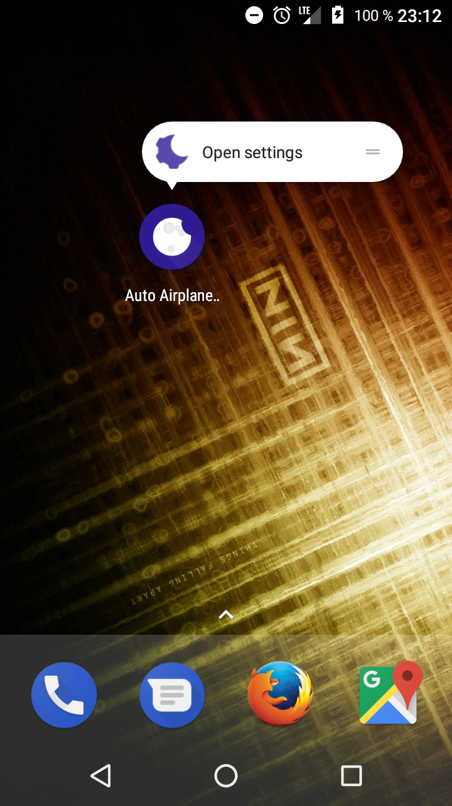
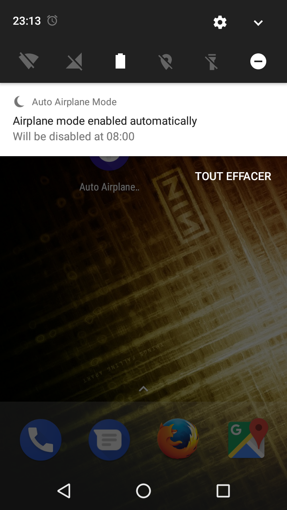

## Introduction

This App for Android 6.0 Marshmallow and later does one thing: it schedules Automatic Airplane Mode based on your settings.

## Requirements

1. A smartphone at least on Android 6.0
2. And with root capabilities

## Screenshots

## Download

[v1.0](https://github.com/MBach/AutoAirplaneMode/releases/download/v1.0/AutoAirplaneMode-1.0.apk)

## Support or Contact

You would like to translate this App in your language, or submit a bug / feature request? Please contribute!
